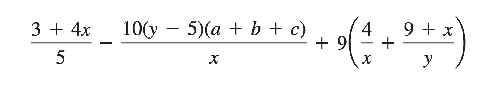

always look at code as

**
    variable = expression**

when looking at equal operators its

    expression == expression

    ex:

**
    if dictionary[name] == numberInDictionary:**

##################################################

# 
    using / and //

/ uses float division and  // used integer/int divisins

my way: **((3 + 4 * x) / 5) – ((10 * (y - 5) * (a + b + c)) / x )+ 9 * (4 / x + (9 + x) / y)**

    sectioned analyzing with each expression

    ((3 + 4 * x) / 5)

    – ((10 * (y - 5) * (a + b + c)) / x )

    + 9 * (4 / x + (9 + x) / y)

###################################################

    exponents

100 ** 1
= 100
= 100

100 ** 2
= 100 * 100
= 10,000

100 ** 3
= 100 * 100 * 100
= 1,000,000

100 ** 4
= 100 * 100 * 100 * 100
= 100,000,000

100 ** 5
= 100 * 100 * 100 * 100 * 100
= 10,000,000,000

