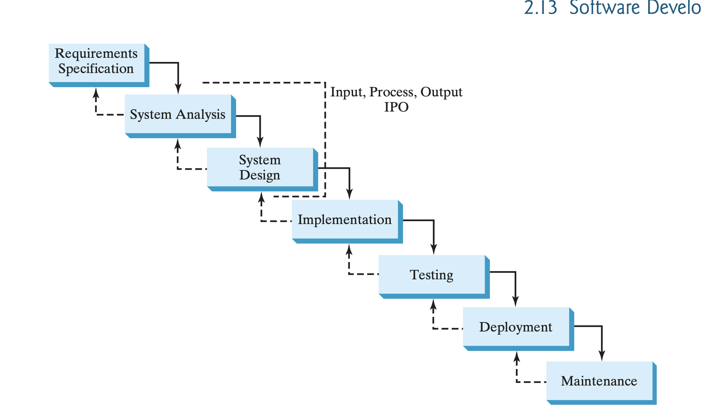

Waterfall Model. Every software engineer, systems engineer, electrical engineer, and even many mechanical engineers use some version of this process. It keeps projects organized and prevents expensive mistakes.

1. Requirements Specification 📋

Question: What does the customer want?

Before writing a single line of code, you figure out the requirements.

Example:

User wants a workout app.
User wants login.
User wants a timer.
User wants exercise tracking.

If you skip this step, you might build the wrong product.

2. System Analysis 🔍

Question: Can we actually build this?

Here you analyze the requirements.

You decide:

What hardware is needed?
What software is needed?
What problems could happen?
How much will it cost?

This is where engineers solve problems before they happen.

3. System Design 🏗️

Question: How will we build it?

Now you make the blueprint.

Examples:

Database design
Class diagrams
Wireframes
Algorithms
User interface sketches

Think of it like an architect drawing a house before construction starts.

4. Implementation 💻

Question: Let's build it.

Now everyone starts coding.

Examples:

Write Python code.
Write Java code.
Build the database.
Connect everything together.

This is the part most beginners think software engineering is.

5. Testing 🧪

Question: Does it actually work?

Engineers look for bugs.

Examples:

Does login work?
Does the timer work?
Does the app crash?
Are calculations correct?

If something breaks, it goes back to Implementation.

6. Deployment 🚀

Question: Release it.

Now the software is given to real users.

Examples:

Upload to the App Store.
Put it on a company server.
Release Version 1.0.
7. Maintenance 🔧

Question: Keep it working.

Software is never truly finished.

Examples:

Fix bugs.
Add new features.
Improve performance.
Update security.

Many software engineers spend most of their careers here.

Why engineers need this

Without SDLC:

❌ People start coding immediately.

❌ Requirements keep changing.

❌ Nobody knows who's responsible.

❌ Bugs pile up.

❌ The customer gets something they never wanted.

With SDLC:

✅ Everyone knows what they're building.

✅ The design is planned first.

✅ Problems are found early.

✅ Testing catches bugs before customers do.

✅ Maintenance keeps the software useful for years.

Your Fitness Workout Planner Capstone followed this process:
Requirements → Decide the app needs profiles, exercises, timers, and workout plans.
Analysis → Choose JavaFX, SQLite, and Java.
Design → Create the database schema, classes, and UI layout.
Implementation → Write all the Java code.
Testing → Fix bugs and make sure every feature works.
Deployment → Submit the final project.
Maintenance → If your team continued the project, you'd fix bugs and add new features.	

##############################################################################################################################

1. Requirements Specification 📋

Question: What does the customer want?

The customer says:

"I want an app where gym members can log in, view their workout plan, and track completed workouts."

These become the requirements.

Requirements:
✔ User login
✔ View workout plan
✔ Mark workouts as completed
✔ Save workout history
2. System Analysis 🔍

Question: What inputs, processes, and outputs are needed?

Output (What should the user see?)
Welcome Tony!

Today's Workout
Bench Press
3 Sets
10 Reps

Completed: Yes
Input (What information do we need?)
Username
Password
Workout database
Completed workout status
Process (What happens?)

1. User logs in.
2. Verify username and password.
3. Find today's workout.
4. Display the workout.
5. Save completion when the user finishes.

Notice how the analyst started with the output, then figured out the inputs and process.

3. System Design 🏗️

Question: How will we build it?

The engineer designs the program before coding.

Database

Users
-----

ID
Username
Password

Workouts
--------

Exercise
Sets
Reps

History
-------

UserID
Date
Completed

The UI might look like:

---

| Welcome Tony       |
| ------------------ |
| Today's Workout    |
| Bench Press        |
| 3 Sets x 10 Reps   |
|                    |
| [Complete Workout] |

---

4. Implementation 💻

Question: Let's build it.

Now the programmers write the code.

Example:

username = input("Username: ")
password = input("Password: ")

if login(username, password):
    displayWorkout()

Now the app actually exists.

5. Testing 🧪

Question: Does everything work?

The testers ask:

Can users log in?

Does the workout appear?

Does the Complete button save correctly?

Does the app crash?

If something fails...

⬅️ Go back to Implementation and fix it.

6. Deployment 🚀

Question: Release it.

The finished app is published.

Google Play Store

Apple App Store

Company Website

Now gym members can download and use it.

7. Maintenance 🔧

Question: Keep improving it.

Users request new features.

"I want dark mode."

"I want nutrition tracking."

"I found a bug."

"The app crashes on Android."

Engineers continue updating the app.

The entire flow
Requirements
↓
Customer wants a gym workout app.

Analysis
↓
Figure out the inputs, processes, and outputs.

Design
↓
Create the database and screen layouts.

Implementation
↓
Write the Python, Java, or C++ code.

Testing
↓
Find and fix bugs.

Deployment
↓
Release the app to users.

Maintenance
↓
Fix bugs and add new features.